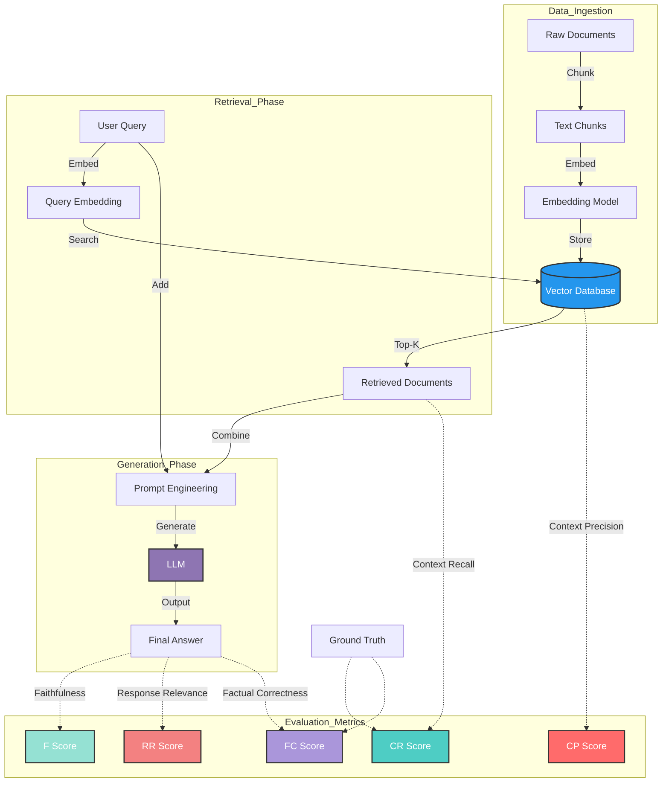
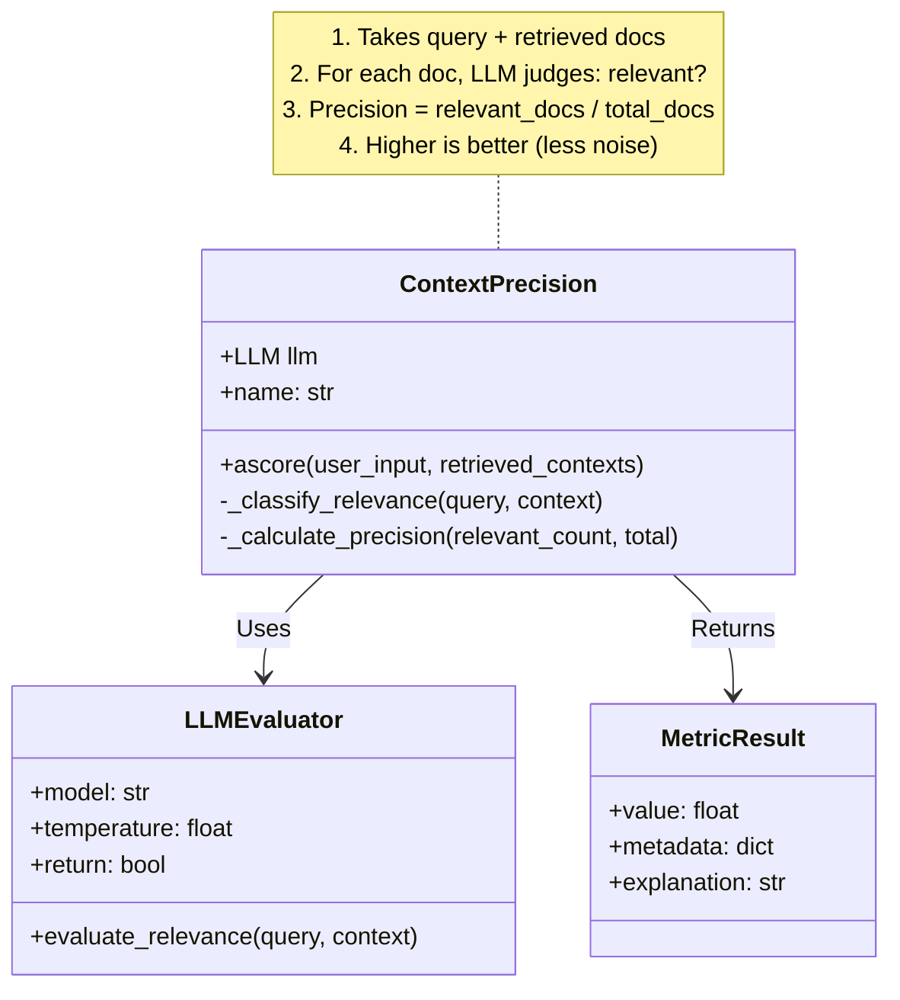
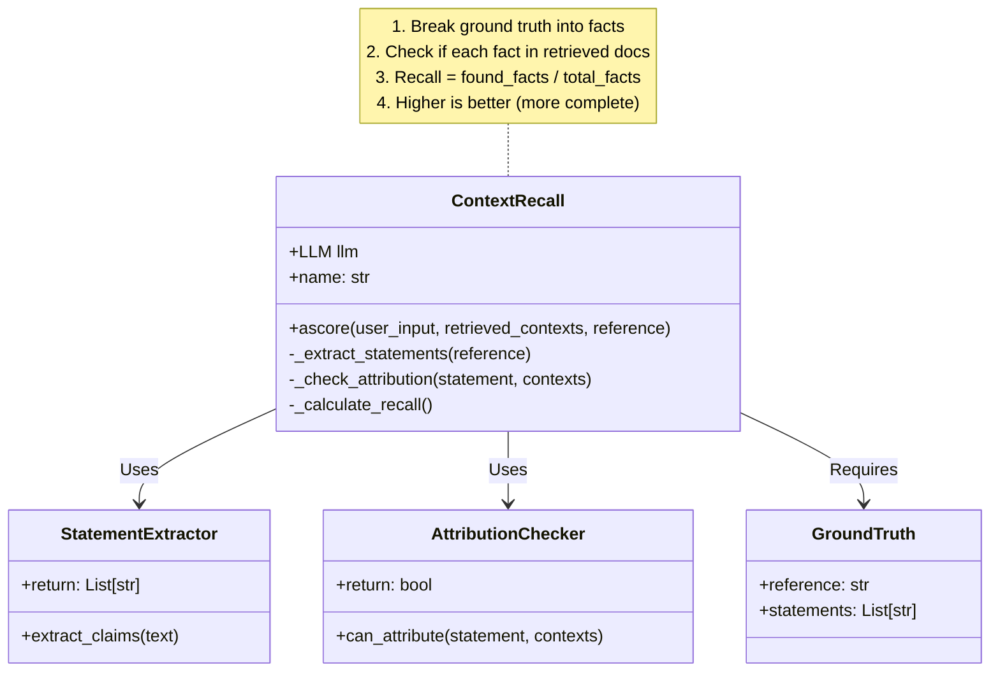
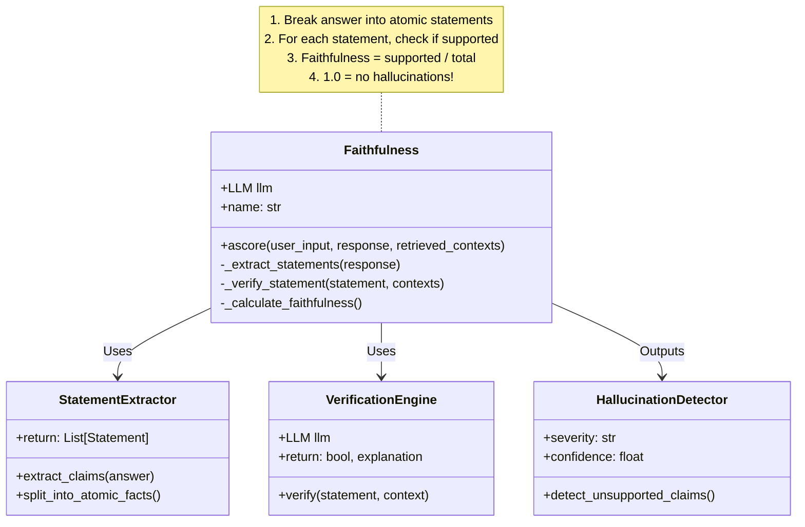
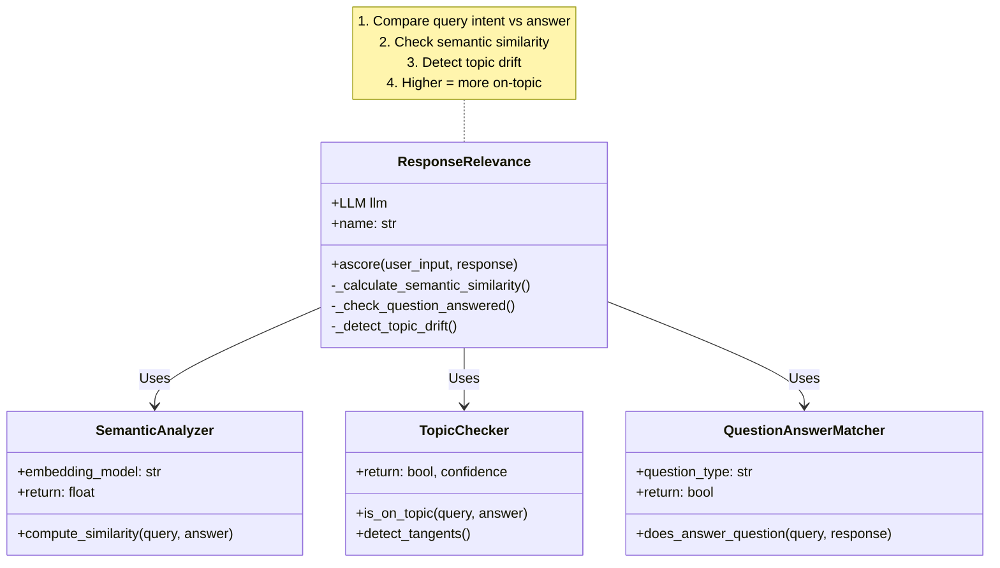
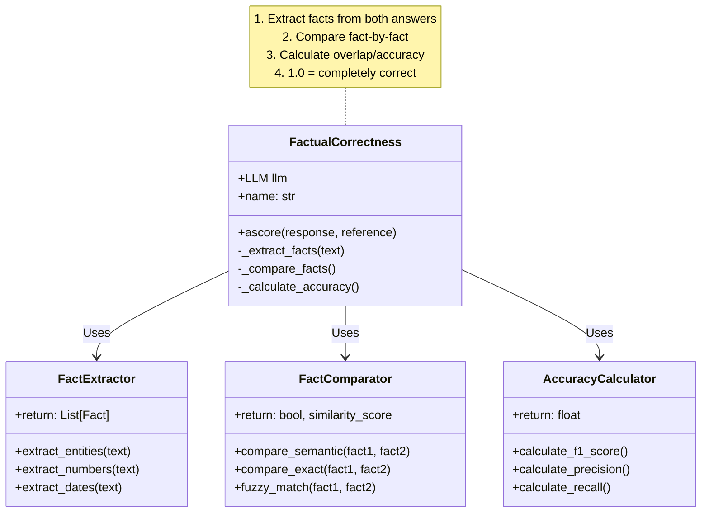
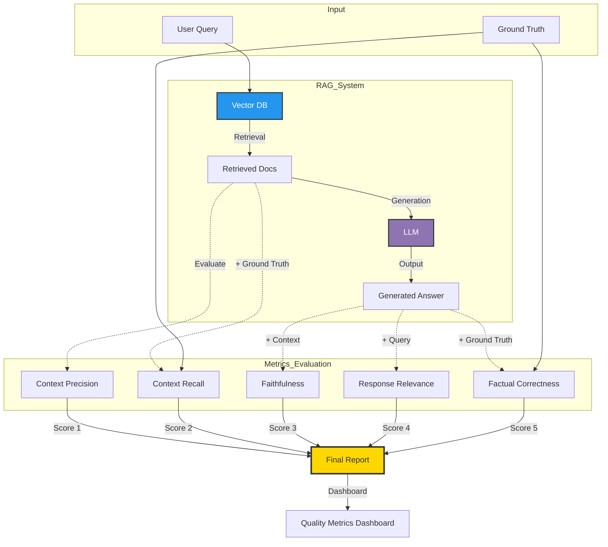
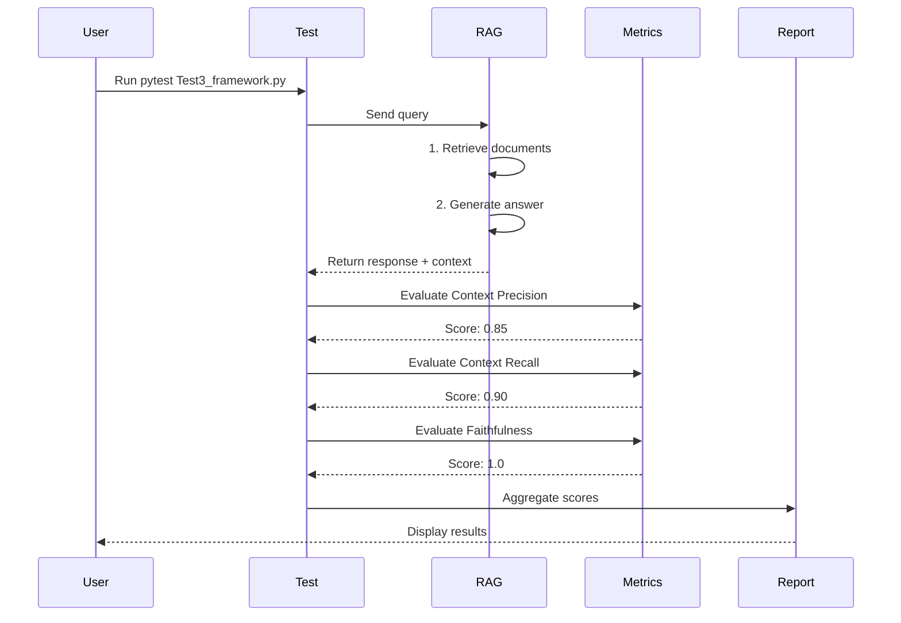

# 🏗️ Ragas Metrics Architecture Guide

Complete architectural breakdown of all Ragas evaluation metrics with High-Level Design (HLD) and Low-Level Design (LLD) diagrams.

---

## 📊 Overall RAG Pipeline Architecture

### High-Level Design (HLD) - Complete RAG Flow



---

## 🎯 Metric 1: Context Precision

### What It Measures
**Does the retrieval system return ONLY relevant documents?**

Context Precision measures the proportion of retrieved documents that are actually relevant to answering the query. It focuses on **quality over quantity** - avoiding noise in the retrieved context.

### High-Level Design (HLD)

```mermaid
graph TD
    A[User Query: "How many articles?"] -->|1. Embed| B[Query Vector]
    B -->|2. Similarity Search| C[(Vector DB)]
    C -->|3. Return Top-K| D[Retrieved Docs]
    
    subgraph Retrieved_Documents
        D1["Doc 1: Course has 23 articles ✅"]
        D2["Doc 2: Payment methods ❌"]
        D3["Doc 3: Article topics ✅"]
        D4["Doc 4: Instructor bio ❌"]
    end
    
    D --> D1
    D --> D2
    D --> D3
    D --> D4
    
    D1 -->|Relevant| E[LLM Evaluator]
    D2 -->|Irrelevant| E
    D3 -->|Relevant| E
    D4 -->|Irrelevant| E
    
    E -->|Calculate| F["Precision = Relevant/Total<br/>= 2/4 = 0.5"]
    
    style D1 fill:#90EE90,stroke:#333,stroke-width:2px
    style D2 fill:#FFB6C1,stroke:#333,stroke-width:2px
    style D3 fill:#90EE90,stroke:#333,stroke-width:2px
    style D4 fill:#FFB6C1,stroke:#333,stroke-width:2px
    style F fill:#FFD700,stroke:#333,stroke-width:3px
```

### Low-Level Design (LLD)



### Formula
```
Context Precision = (Number of Relevant Retrieved Documents) / (Total Retrieved Documents)

Example:
Retrieved: 4 docs
Relevant: 2 docs
Precision = 2/4 = 0.5 (50%)
```

---

## 🔍 Metric 2: Context Recall

### What It Measures
**Did the retrieval system get ALL the necessary information?**

Context Recall measures whether all the information needed to answer the question (present in the ground truth) was successfully retrieved. It focuses on **completeness** - ensuring nothing important is missed.

### High-Level Design (HLD)

```mermaid
graph TD
    A[User Query: "What's included?"] -->|Retrieve| B[Retrieved Context]
    C[Ground Truth: "23 articles, 9 resources, certificate"] 
    
    subgraph Retrieved_Context
        R1["✅ Found: 23 articles"]
        R2["✅ Found: 9 resources"]
        R3["❌ Missing: certificate"]
    end
    
    B --> R1
    B --> R2
    B --> R3
    
    C -->|Compare| D[LLM Evaluator]
    B -->|Compare| D
    
    D -->|Extract Statements| E["Ground Truth Facts:<br/>1. 23 articles<br/>2. 9 resources<br/>3. certificate"]
    
    E -->|Check Coverage| F["Recall = Found/Total<br/>= 2/3 = 0.67"]
    
    style R1 fill:#90EE90,stroke:#333,stroke-width:2px
    style R2 fill:#90EE90,stroke:#333,stroke-width:2px
    style R3 fill:#FFB6C1,stroke:#333,stroke-width:2px
    style F fill:#4ECDC4,stroke:#333,stroke-width:3px
```

### Low-Level Design (LLD)



### Formula
```
Context Recall = (Statements in Ground Truth attributed to Retrieved Context) / (Total Statements in Ground Truth)

Example:
Ground Truth: 3 facts
Found in Context: 2 facts
Recall = 2/3 = 0.67 (67%)
```

---

## ✨ Metric 3: Faithfulness

### What It Measures
**Is the LLM's answer grounded in the retrieved context?**

Faithfulness measures whether every claim in the generated answer can be verified from the retrieved context. It's your **hallucination detector** - ensuring the LLM doesn't make up information.

### High-Level Design (HLD)

```mermaid
graph TD
    A[Retrieved Context:<br/>"Course has 23 articles"] -->|Provide| B[LLM]
    C[Query: "Tell me about the course"] -->|Ask| B
    
    B -->|Generate| D["Answer: 'The course has 23 articles<br/>and was created in 2020 by John Doe'"]
    
    D -->|Extract| E[Statement Extraction]
    
    subgraph Statements
        S1["1. Course has 23 articles"]
        S2["2. Created in 2020"]
        S3["3. Created by John Doe"]
    end
    
    E --> S1
    E --> S2
    E --> S3
    
    A -->|Verify| F[Attribution Checker]
    S1 -->|Check| F
    S2 -->|Check| F
    S3 -->|Check| F
    
    F -->|Supported ✅| G1[Statement 1: YES]
    F -->|Not Found ❌| G2[Statement 2: NO]
    F -->|Not Found ❌| G3[Statement 3: NO]
    
    G1 --> H["Faithfulness = 1/3 = 0.33<br/>⚠️ HIGH HALLUCINATION!"]
    G2 --> H
    G3 --> H
    
    style G1 fill:#90EE90,stroke:#333,stroke-width:2px
    style G2 fill:#FFB6C1,stroke:#333,stroke-width:2px
    style G3 fill:#FFB6C1,stroke:#333,stroke-width:2px
    style H fill:#FF6B6B,stroke:#333,stroke-width:3px
```

### Low-Level Design (LLD)



### Formula
```
Faithfulness = (Statements Supported by Context) / (Total Statements in Answer)

Example:
Answer has: 3 statements
Supported: 1 statement
Faithfulness = 1/3 = 0.33 (33%) ⚠️ Poor!
```

---

## 💬 Metric 4: Response Relevance

### What It Measures
**Does the answer actually address the user's question?**

Response Relevance measures how well the generated answer addresses the original query. It ensures the LLM **stays on topic** and doesn't provide tangential information.

### High-Level Design (HLD)

```mermaid
graph TD
    A[User Query:<br/>"How many articles are in the course?"] 
    
    B1[Answer 1:<br/>"There are 23 articles"]
    B2[Answer 2:<br/>"The course is comprehensive<br/>with many great features"]
    
    A -->|Evaluate| C[Relevance Evaluator]
    B1 -->|Score| C
    
    A -->|Evaluate| D[Relevance Evaluator]
    B2 -->|Score| D
    
    C -->|Direct Answer ✅| E["Relevance Score: 1.0<br/>Perfectly addresses question"]
    D -->|Off-topic ❌| F["Relevance Score: 0.2<br/>Doesn't answer question"]
    
    style E fill:#90EE90,stroke:#333,stroke-width:3px
    style F fill:#FFB6C1,stroke:#333,stroke-width:3px
```

### Low-Level Design (LLD)



### Formula
```
Response Relevance = Semantic Similarity(Query, Answer) + Topic Alignment

Example:
Query: "How many articles?"
Answer: "23 articles" → Relevance: 1.0 (perfect)
Answer: "Course is great" → Relevance: 0.2 (off-topic)
```

---

## ✅ Metric 5: Factual Correctness

### What It Measures
**Is the answer factually correct compared to the ground truth?**

Factual Correctness measures the accuracy of the generated answer against the known correct answer. It validates the **entire RAG pipeline** end-to-end.

### High-Level Design (HLD)

```mermaid
graph TD
    A[Ground Truth:<br/>"There are 23 articles in the course"] 
    
    B1[Generated Answer 1:<br/>"There are 23 articles"]
    B2[Generated Answer 2:<br/>"There are 28 articles"]
    B3[Generated Answer 3:<br/>"The course has twenty-three articles"]
    
    A -->|Compare| C[Fact Checker]
    B1 -->|Validate| C
    
    A -->|Compare| D[Fact Checker]
    B2 -->|Validate| D
    
    A -->|Compare| E[Fact Checker]
    B3 -->|Validate| E
    
    C -->|Exact Match ✅| F["Correctness: 1.0<br/>Perfect accuracy"]
    D -->|Wrong Number ❌| G["Correctness: 0.0<br/>Factually incorrect"]
    E -->|Semantic Match ✅| H["Correctness: 1.0<br/>Same meaning"]
    
    style F fill:#90EE90,stroke:#333,stroke-width:3px
    style G fill:#FF6B6B,stroke:#333,stroke-width:3px
    style H fill:#90EE90,stroke:#333,stroke-width:3px
```

### Low-Level Design (LLD)



### Formula
```
Factual Correctness = (Correct Facts in Answer) / (Total Facts in Ground Truth)

Using F1 Score:
Precision = Correct / Predicted
Recall = Correct / Actual
F1 = 2 * (Precision * Recall) / (Precision + Recall)

Example:
Ground Truth: "23 articles"
Answer: "28 articles" → Correctness: 0.0 (wrong)
Answer: "23 articles" → Correctness: 1.0 (correct)
```

---

## 🔄 Complete Evaluation Pipeline

### System Architecture



---

## 📊 Metrics Comparison Table

| Metric | Input Required | What It Checks | When To Use | Implementation Status |
|--------|---------------|----------------|-------------|----------------------|
| **Context Precision** | Query + Retrieved Docs | Quality of retrieval (relevance) | Reduce noise in context | ✅ Test1.py |
| **Context Recall** | Query + Retrieved Docs + Ground Truth | Completeness of retrieval | Ensure nothing missed | ✅ Test2.py, Test3.py |
| **Faithfulness** | Response + Retrieved Context | Groundedness (no hallucinations) | Detect made-up facts | ✅ Test4.py |
| **Response Relevance** | Query + Response | On-topic answer | Check answer quality | ❌ Coming Soon |
| **Factual Correctness** | Response + Ground Truth | Factual accuracy | End-to-end validation | ❌ Coming Soon |

---

## 🎯 Best Practices

### 1. Use Metrics Together
```
Good RAG = High Precision (0.9) + High Recall (0.9) + High Faithfulness (1.0)
```

### 2. Threshold Guidelines
- **Context Precision:** > 0.8 (at least 80% relevant docs)
- **Context Recall:** > 0.7 (capture 70%+ of information)
- **Faithfulness:** > 0.9 (less than 10% hallucination)
- **Response Relevance:** > 0.8 (80%+ on-topic)
- **Factual Correctness:** > 0.9 (90%+ accurate)

### 3. Debug Workflow
```
Low Precision? → Improve retrieval ranking
Low Recall? → Increase K, better chunking
Low Faithfulness? → Constrain LLM, better prompts
Low Relevance? → Improve prompt engineering
Low Correctness? → Fix entire pipeline
```

---

## 🚀 Implementation Example

### Complete Test Flow



---

## 📚 References

- [Ragas Official Documentation](https://docs.ragas.io/)
- [RAG Evaluation Paper](https://arxiv.org/abs/2309.15217)
- [LLM Hallucination Detection](https://arxiv.org/abs/2311.08754)

---

<div align="center">

**Made with ❤️ by [Abhinav](https://github.com/abhi9avx)**

For questions or contributions, open an issue on GitHub!

</div>
