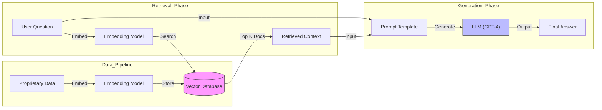

# 🦜️🔗 Ragas LLM Evaluation Framework

> **The Ultimate Guide to Testing & Evaluating Custom LLM Applications**

## 📖 Introduction: Why This Project Exists?

### ❓ The Problem
Building an LLM app is easy. **Ensuring it works correctly is hard.**
- When you build a **RAG (Retrieval Augmented Generation)** system, how do you know if it retrieved the *right* document?
- How do you know if the LLM isn't **hallucinating** (making things up)?
- How do you measure if the answer is accurate without manually checking 1000s of queries?

### 💡 The Solution: Ragas
**Ragas** (Retrieval Augmented Generation Assessment) is a framework that provides **quantitative metrics** to evaluate your LLM pipeline. It's like a "Unit Test" for your AI.

This project implements a complete **Test Automation Framework** for LLMs using **Pytest** and **Ragas**, ensuring your AI is reliable, accurate, and production-ready.

---

## 🏗️ Architecture & Testing Scope

We test the entire lifecycle of an AI response, from data retrieval to final generation.



### 🎯 We Test 3 Key Areas:
1.  **Retrieval Module:** Are we finding the right data? (Precision & Recall)
2.  **Generation Module:** Is the LLM answering correctly? (Faithfulness & Relevance)
3.  **End-to-End:** Is the entire system working? (Factual Correctness & Topic Adherence)

---

## 📊 Evaluation Metrics Explained

We use 7 core metrics to score our LLM. Here is what they mean in simple terms:

| Metric | Phase | What it checks? | Why it matters? |
| :--- | :--- | :--- | :--- |
| **Context Precision** | Retrieval | **Signal-to-Noise Ratio.** Did we retrieve *only* useful documents? | reduces LLM confusion. |
| **Context Recall** | Retrieval | **Completeness.** Did we retrieve *all* the necessary facts? | Ensures no missing info. |
| **Faithfulness** | Generation | **Hallucination Check.** Is the answer derived *only* from the context? | Prevents lying. |
| **Answer Relevance** | Generation | **On-Topic Check.** Did the LLM actually answer the specific question? | Ensures usefulness. |
| **Factual Correctness** | End-to-End | **Truth Check.** Does the answer match the "Ground Truth"? | Ensures accuracy. |
| **Topic Adherence** | Multi-Turn | **Drift Check.** Does the bot stay on topic during a long chat? | Vital for chatbots. |
| **Rubrics Score** | Custom | **Rule Check.** Does the answer meet specific custom rules? | Custom business logic. |

---

## 🚀 Key Features

*   **🧪 Automated Pytest Suite:** Standard software testing practices applied to AI.
*   **🧬 Synthetic Data Factory:** Automatically generates test cases from your documents (`fs11/` folder).
*   **📈 Dashboard (Streamlit):** Visualise pass/fail rates and analyze trends over time.
*   **🔄 Multi-Turn Support:** Validates conversational history, not just single questions.
*   **⚙️ CI/CD Integration:** Runs automatically on GitHub Actions.

---

## 🛠️ Tech Stack

*   **Language:** Python 3.10+
*   **Testing Framework:** Pytest (Asyncio)
*   **Evaluation Engine:** Ragas
*   **LLM Provider:** OpenAI (GPT-4o)
*   **Orchestration:** LangChain
*   **Visualization:** Streamlit, Plotly

---

## ⚡️ Quick Start Guide

### 1️⃣ Setup & Install
```bash
git clone https://github.com/abhi9avx/ragas-llm-evaluation.git
cd ragas-llm-evaluation
python3 -m venv venv
source venv/bin/activate
pip install -r requirements.txt
export OPENAI_API_KEY="sk-..."
```

### 2️⃣ Run Tests (The "Golden Commands")

| Test File | Description | Command |
| :--- | :--- | :--- |
| `Test1.py` | Check **Retrieval Precision** | `pytest -s Test1.py` |
| `Test2.py` | Check **Retrieval Recall** | `pytest -s Test2.py` |
| `Test3_framework.py` | Run **Parametrized Suite** | `pytest -s Test3_framework.py` |
| `Test4.py` | Check **Faithfulness** | `pytest -s Test4.py` |
| `Test5.py` | Check **Relevance & Accuracy** | `pytest -s Test5.py` |
| `Test6.py` | Check **Topic Adherence** | `pytest -s Test6.py` |
| `Test7.py` | Check **Rubrics Score** | `pytest -s Test7.py` |

### 3️⃣ Generate Test Data
Don't have test data? Let AI write it for you!
```bash
# Reads docs from fs11/ and creates 10 test questions
python testDataFeaxtory.py 10
```

### 4️⃣ Launch Dashboard
See your results in a professional UI.
```bash
streamlit run dashboard/app.py
```

---

## 📂 Project Structure

```text
ragas-llm-evaluation/
├── evaluation/
│   └── run_eval.py             # 🧠 Main execution engine
├── dashboard/
│   └── app.py                  # 📊 Streamlit dashboard
├── testDataFeaxtory.py         # 🧬 Synthetic data generator factory
├── results/                    # 💾 Stores history of runs (JSON/CSV)
├── fs11/                       # 📂 Source documents (PDF/Docx)
├── Test1.py - Test7.py         # 🧪 Individual Test Scripts
└── requirements.txt            # 📦 Dependencies
```

---

## 🔮 Upcoming Features

*   **Self-Healing RAG:** Automatically rewrite failing retrieval queries based on low scores.
*   **Cost Analysis:** Track token usage and estimated cost per evaluation run.
*   **Vector DB Integration:** Direct connectors for Pinecone, Weaviate, and Milvus.
*   **Slack/Discord Alerts:** Get notified immediately when your model quality drops.

---

<div align="center">

### Made with ❤️ by [Abhinav (abhi9avx)](https://github.com/abhi9avx) 🚀

</div>

